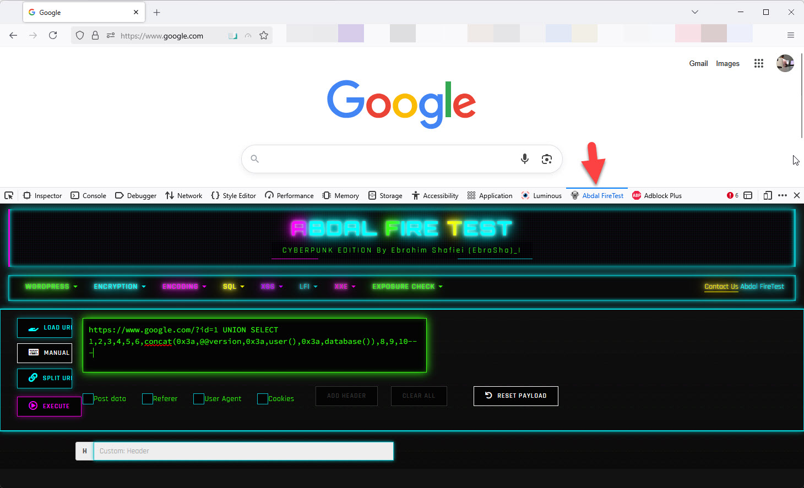

# 🔥 ابدال فایرتست - نسخه سایبرپانک

  

**[🇮🇷 فارسی](README.fa.md)** | **[🇬🇧 English](README.md)**

## 📋 مرور کلی
ابدال فایرتست یک افزونه قدرتمند مرورگر است که برای متخصصان امنیت سایبری و هکرهای اخلاق‌مدار طراحی شده است. این افزونه مجموعه‌ای جامع از ابزارهای تست امنیت وب را با رابط کاربری زیبای سایبرپانک ارائه می‌دهد. این افزونه منحصراً برای مرورگر موزیلا فایرفاکس در دسترس است.

## 🛡️ هدف
این افزونه برای کمک به متخصصان امنیت سایبری در انجام تست نفوذ قانونی و اخلاقی در چارچوب اصول اخلاقی توسعه یافته است. این ابزار فرآیند تست برنامه‌های وب برای آسیب‌پذیری‌ها را ساده‌تر می‌کند و در عین حال استانداردهای حرفه‌ای و بهترین شیوه‌ها را حفظ می‌نماید.

## ✨ قابلیت‌ها

### 🔍 تست امنیت وردپرس
- **شمارش کاربران وردپرس** - کشف کاربران وردپرس
- **بررسی نشت فایل پیکربندی** - تست برای فایل‌های پیکربندی در دسترس
- **تشخیص نسخه وردپرس** - شناسایی نسخه وردپرس و آسیب‌پذیری‌ها
- **تشخیص لیست دایرکتوری** - یافتن دایرکتوری‌هایی که لیست محتوا در آنها فعال است

### 🔐 ابزارهای رمزنگاری و کدگذاری
- **رمزنگاری** - MD5, SHA1, SHA256, SHA3, SHA224, SHA384, SHA512, ROT13
- **کدگذاری/کدگشایی** - Base64, URL و Hex

### 💉 تست تزریق SQL
- **مبتنی بر خطا** - تست آسیب‌پذیری‌های تزریق SQL مبتنی بر خطا
- **مبتنی بر UNION** - تست تکنیک‌های تزریق SQL مبتنی بر UNION
- **مبتنی بر بولین** - تست روش‌های تزریق مبتنی بر بولین کور
- **مبتنی بر زمان** - تست تکنیک‌های تزریق کور مبتنی بر زمان
- **خارج از باند** - تست آسیب‌پذیری‌های تزریق خارج از باند

### 🕸️ تست XSS (اسکریپت‌نویسی متقاطع سایت)
- **String.fromCharCode** - تست بردارهای XSS با کد کاراکتر
- **کاراکترهای HTML** - تست XSS مبتنی بر موجودیت HTML
- **هشدار/تصویر/مبتنی بر DOM** - پیلودهای متعدد XSS برای زمینه‌های مختلف
- **SVG/CSS/iframe** - تست بردارهای پیشرفته XSS
- **چندمنظوره/مدیریت رویداد** - تست XSS چندزمینه‌ای
- **Angular/JSFuck** - تست XSS مخصوص فریم‌ورک
- **ذخیره‌شده/بازتابی/موتاسیون** - تست انواع مختلف حملات XSS
- **دور زدن CSP** - تست دور زدن سیاست امنیتی محتوا

### 📁 تست LFI (شامل‌سازی فایل محلی)
- **پیلود پایه** - تست آسیب‌پذیری‌های ساده LFI
- **تزریق بایت صفر** - تست دور زدن LFI با بایت صفر
- **عبور از مسیر** - تست حملات عبور از مسیر
- **پوشش PHP** - تست تکنیک‌های پوشش فیلتر PHP

### 📄 تست XXE (موجودیت خارجی XML)
- **LFI از طریق XXE** - تست XXE برای شامل‌سازی فایل محلی
- **XXE کور** - تست آسیب‌پذیری‌های XXE کور
- **SSRF از طریق XXE** - تست جعل درخواست سمت سرور از طریق XXE
- **RCE از طریق XXE** - تست اجرای کد از راه دور از طریق XXE
- **XXE DOS** - تست حمله انکار سرویس از طریق حمله میلیاردها خنده

### 🔎 تشخیص افشای اطلاعات
- **فایل‌های پایگاه داده** - بررسی فایل‌های پشتیبان پایگاه داده و فایل‌های SQL در دسترس

## 🚀 نحوه استفاده

### نصب
1. افزونه را از فروشگاه رسمی افزونه‌های موزیلا فایرفاکس نصب کنید:
   - 🦊 [افزونه‌های فایرفاکس: ابدال فایرتست](https://addons.mozilla.org/en-US/firefox/addon/abdal-firetest/)
2. ابزارهای توسعه‌دهنده فایرفاکس را باز کنید (F12)
3. به پنل "ابدال فایرتست" بروید

### استفاده پایه
1. به وب‌سایت هدف بروید
2. روی "بارگذاری URL" کلیک کنید تا URL صفحه فعلی دریافت شود
3. تست مناسب را از دسته‌های منو انتخاب کنید
4. پیلود تولید شده یا نتایج تست را بررسی کنید
5. از دکمه "اجرا" برای اجرای تست استفاده کنید

### بررسی‌های امنیتی
1. برای بررسی‌های غیرفعال (مانند تشخیص نشت پیکربندی وردپرس)، نوع بررسی را انتخاب کنید
2. نتایج را در گزارش قالب‌بندی شده حرفه‌ای بررسی کنید
3. توصیه‌های امنیتی ارائه شده را دنبال کنید

### تولید پیلود
1. نوع پیلود مورد نظر را از منوی مناسب انتخاب کنید
2. افزونه به طور خودکار پیلود را با استفاده از URL فعلی تولید می‌کند
3. در صورت نیاز می‌توانید پیلود را تغییر دهید
4. روی "اجرا" کلیک کنید تا پیلود اجرا شود

## ⚠️ هشدار استفاده اخلاقی
این ابزار فقط برای **تست امنیتی قانونی و اخلاقی** طراحی شده است. همیشه:
- قبل از تست هر وب‌سایت، مجوز مناسب را دریافت کنید
- شیوه‌های افشای مسئولانه را دنبال کنید
- به قوانین حفظ حریم خصوصی و محافظت از داده‌ها احترام بگذارید
- از این ابزار فقط روی سیستم‌هایی که مجاز به تست آنها هستید استفاده کنید

## 🐛 گزارش مشکلات
اگر با مشکلی مواجه شدید یا در پیکربندی مشکل دارید، لطفاً از طریق ایمیل Prof.Shafiei@Gmail.com با ما در تماس باشید. همچنین می‌توانید مشکلات را در GitLab یا GitHub گزارش دهید.

## ❤️ حمایت مالی
اگر این پروژه برای شما مفید بود و مایل به حمایت از توسعه بیشتر هستید، لطفاً در نظر داشته باشید که کمک مالی کنید:
- [اینجا اهدا کنید](https://alphajet.ir/abdal-donation)

## 🤵 برنامه‌نویس
ساخته شده با عشق توسط **ابراهیم شفیعی (EbraSha)**
- **ایمیل**: Prof.Shafiei@Gmail.com
- **تلگرام**: [@ProfShafiei](https://t.me/ProfShafiei)

## 📜 مجوز
این پروژه تحت مجوز GPLv2 or later منتشر شده است. 