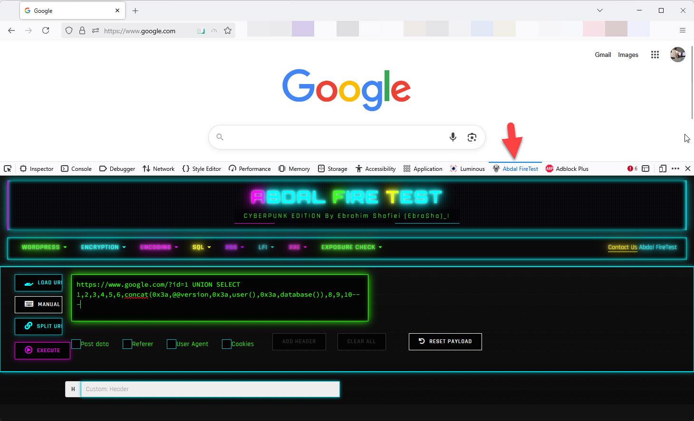

# 🔥 Abdal FireTest - Cyberpunk Edition

  

**[🇮🇷 فارسی](README.fa.md)** | **[🇬🇧 English](README.md)**

## 📋 Overview
Abdal FireTest is a powerful browser extension designed for cybersecurity professionals and ethical hackers. It provides a comprehensive suite of web security testing tools with a sleek cyberpunk-themed interface. This extension is exclusively available for Mozilla Firefox.

## 🛡️ Purpose
This extension was developed to help cybersecurity specialists conduct legal and ethical penetration testing within ethical boundaries. It simplifies the process of testing web applications for vulnerabilities while maintaining professional standards and best practices.

## ✨ Features

### 🔍 WordPress Security Testing
- **WordPress Users Enumeration** - Discover WordPress users
- **WP Config Leak Checker** - Test for exposed configuration files
- **WordPress Version Detection** - Identify WordPress version and vulnerabilities
- **Directory Listing Detection** - Find directories with listing enabled

### 🔐 Encryption & Encoding Tools
- **Encryption** - MD5, SHA1, SHA256, SHA3, SHA224, SHA384, SHA512, ROT13
- **Encoding/Decoding** - Base64, URL, and Hex

### 💉 SQL Injection Testing
- **Error-Based** - Test for error-based SQL injection vulnerabilities
- **Union-Based** - Test UNION-based SQL injection techniques
- **Boolean-Based** - Test blind boolean-based injection methods
- **Time-Based** - Test time-based blind injection techniques
- **Out-Of-Band** - Test for out-of-band injection vulnerabilities

### 🕸️ XSS (Cross-Site Scripting) Testing
- **String.fromCharCode** - Test character code XSS vectors
- **HTML Characters** - Test HTML entity-based XSS
- **Alert/Image/DOM-based** - Multiple XSS payloads for different contexts
- **SVG/CSS/iframe** - Advanced XSS vector testing
- **Polyglot/Event Handlers** - Multi-context XSS testing
- **Angular/JSFuck** - Framework-specific XSS testing
- **Stored/Reflected/Mutation** - Test various XSS attack types
- **CSP Bypass** - Test Content Security Policy bypasses

### 📁 LFI (Local File Inclusion) Testing
- **Basic Payload** - Test simple LFI vulnerabilities
- **Null Byte Injection** - Test null byte LFI bypasses
- **Path Traversal** - Test directory traversal attacks
- **PHP Wrapper** - Test PHP filter wrapper techniques

### 📄 XXE (XML External Entity) Testing
- **LFI via XXE** - Test XXE for local file inclusion
- **Blind XXE** - Test blind XXE vulnerabilities
- **SSRF via XXE** - Test server-side request forgery via XXE
- **RCE via XXE** - Test remote code execution via XXE
- **XXE DOS** - Test denial of service via billion laughs attack

### 🔎 Exposure Detection
- **Database Files** - Check for exposed database backup files and SQL dumps

## 🚀 How to Use

### Installation
1. Install the extension from the official Mozilla Firefox Add-ons store:
   - 🦊 [Firefox Add-ons: Abdal FireTest](https://addons.mozilla.org/en-US/firefox/addon/abdal-firetest/)
2. Open Firefox's developer tools (F12)
3. Navigate to the "Abdal FireTest" panel

### Basic Usage
1. Navigate to the target website
2. Click "Load URL" to fetch the current page URL
3. Select the appropriate test from the menu categories
4. Review the generated payload or test results
5. Use the "Execute" button to run the test

### Security Checks
1. For passive checks (like WordPress config leak detection), select the check type
2. Review the results in the professionally formatted report
3. Follow the security recommendations provided

### Payload Generation
1. Select the desired payload type from the appropriate menu
2. The extension will automatically generate the payload using the current URL
3. You can modify the payload if needed
4. Click "Execute" to run the payload

## ⚠️ Ethical Usage Warning
This tool is meant for **legal and ethical security testing only**. Always:
- Obtain proper authorization before testing any website
- Follow responsible disclosure practices
- Respect privacy and data protection laws
- Use this tool only on systems you are authorized to test

## 🐛 Reporting Issues
If you encounter any issues or have configuration problems, please reach out via email at Prof.Shafiei@Gmail.com. You can also report issues on GitLab or GitHub.

## ❤️ Donation
If you find this project helpful and would like to support further development, please consider making a donation:
- [Donate Here](https://alphajet.ir/abdal-donation)

## 🤵 Programmer
Handcrafted with Passion by **Ebrahim Shafiei (EbraSha)**
- **E-Mail**: Prof.Shafiei@Gmail.com
- **Telegram**: [@ProfShafiei](https://t.me/ProfShafiei)

## 📜 License
This project is licensed under the GPLv2 or later License. 